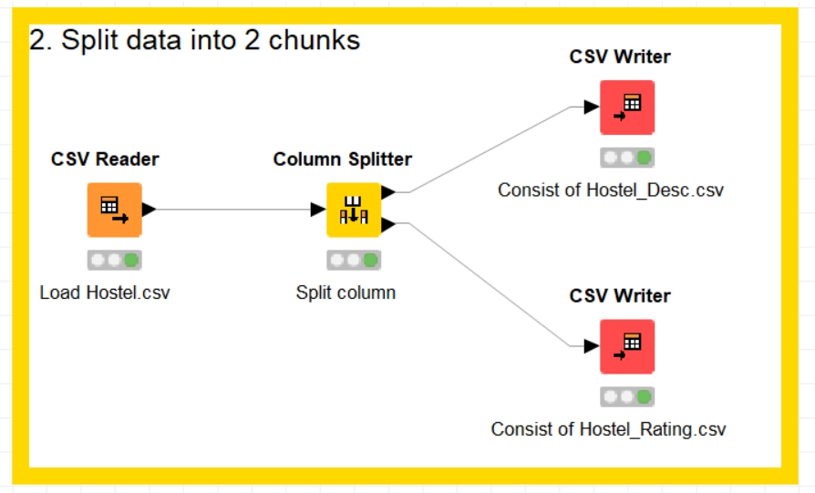

# **Japanese Hostel Dataset**

## **Business Understanding**

### Kemungkinan proses yang dapat dilakukan

- Mencari jarak hostel terdekat dari lokasi tertentu
- Mencari rating hostel tertinggi
- Mencari harga hostel yang murah

## **Data Understanding**

- jumlah data sebanyak **342 baris**

- hostel.name: **nama** hostel
- City: **nama kota** tempat lokasi hostel
- price.from: **harga minimal** untuk menginap 1 malam
- Distance: **jarak dari pusat kota** (km)
- summary.score: kesimpulan **skor rating secara keseluruhan**
- rating.band: **label** rating
- atmosphere: skor rating untuk **atmosphere**
- cleanliness: skor rating untuk **kebersihan**
- facilities: skor rating untuk **fasilitas**
- location.y: skor rating **lokasi**
- security: skor rating untuk **keamanan**
- staff: skor rating untuk **staff**
- valueformoney: skor rating **nilai kepuasan** atas uang yang telah dibayar
- lon: derajat **garis bujur**
- lat: derajat **garis lintang**

## **Data Preparation**

### Proses splitting data:

1. Load file Hostel.csv
2. Split column dengan memisah antara,
   - kolom tabel Description
     - hostel.name
     - City
     - price.from
     - Distance
     - lon
     - lat
   - dan kolom tabel Rating
     - summary.score
     - rating.band
     - atmosphere
     - cleanliness
     - facilities
     - location.y
     - security
     - staff
     - valueformoney

3. Simpan dalam file sesuai nama masing - masing
   - tabel Description disimpan sebagai Hostel_Desc.csv
   - tabel Rating disimpan sebagai Hostel_Rating.csv

## **Modelling**

### Membaca data dari dua sumber

### Proses Append

## **Evaluation**

## **Deployment**

### Penyimpanan hasil append ke dalam file dan database

